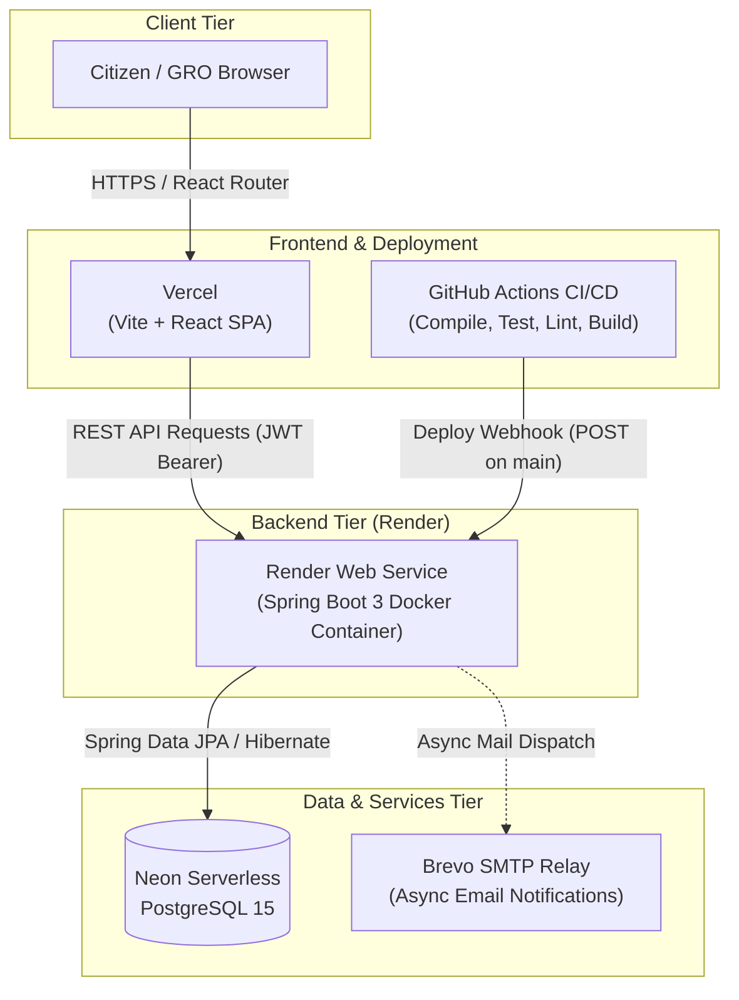
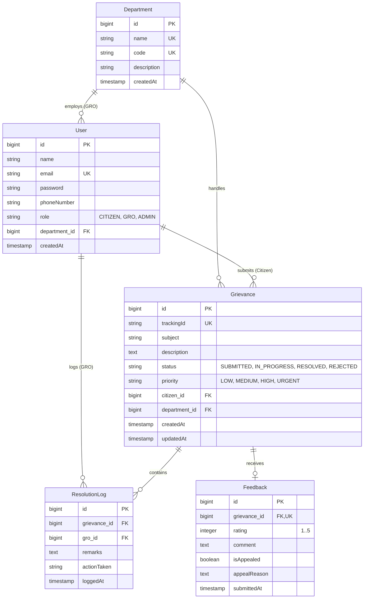

# Government Grievance Redressal Portal

> A transparent, full-stack civic-tech platform for reporting, triaging, and resolving municipal grievances with end-to-end citizen tracking and departmental accountability.

## Live Demo

| Service | Live URL | Description |
|---|---|---|
| **Frontend Application** | [https://grievance-redressal-portal-beryl.vercel.app](https://grievance-redressal-portal-beryl.vercel.app) | **Main entry point** for Citizens and Officers (Vercel) |
| **Backend API Base** | [https://government-grievance-redressal-portal.onrender.com](https://government-grievance-redressal-portal.onrender.com) | Spring Boot REST API service (Render) |
| **Swagger UI** | [https://government-grievance-redressal-portal.onrender.com/swagger-ui/index.html](https://government-grievance-redressal-portal.onrender.com/swagger-ui/index.html) | Interactive OpenAPI 3.0 API explorer & contract |
| **Health Check Endpoint** | [https://government-grievance-redressal-portal.onrender.com/actuator/health](https://government-grievance-redressal-portal.onrender.com/actuator/health) | Live service health & liveness probe |

> **Note:** The backend runs on a free tier and sleeps when idle; the first request can take up to ~50 seconds.

---

[](https://github.com/Shivasooryan-777/government-grievance-redressal-portal/actions/workflows/ci-cd.yml)
[](https://www.oracle.com/java/)
[](https://spring.io/projects/spring-boot)
[](https://react.dev/)
[](https://www.postgresql.org/)

---

## Demo Access

- **Citizen Access**: Citizens can self-register directly on the live site at [`/register`](https://grievance-redressal-portal-beryl.vercel.app/register) or log in at [`/citizen-login`](https://grievance-redressal-portal-beryl.vercel.app/citizen-login).
- **GRO (Grievance Redressal Officer) Access**: The database is seeded with departmental officer accounts across the 5 core civic domains:
  - `water.gro@grievanceportal.local` — Water Supply & Sanitation (`WATER`)
  - `electricity.gro@grievanceportal.local` — Electricity (`ELECTRICITY`)
  - `roads.gro@grievanceportal.local` — Roads & Infrastructure (`ROADS`)
  - `health.gro@grievanceportal.local` — Public Health & Sanitation (`HEALTH`)
  - `admin.gro@grievanceportal.local` — General Administration (`GEN_ADMIN`)
- **Officer Credentials**: GRO default passwords are deterministic and securely managed via environment variables. Specific login credentials for evaluation are shared separately with evaluators.

---

## The Problem

Citizens frequently struggle to report and track everyday municipal issues like broken streetlights, water contamination, and potholes through fragmented and opaque bureaucratic channels. Traditional complaint mechanisms lack centralized tracking, leaving citizens without status visibility or accountability once a report is filed. At the same time, municipal officers are overwhelmed by unstructured complaints without priority triaging, departmental routing, or audit logging. This portal bridges the civic communication divide with an open, trackable, and verifiable redressal workflow connecting citizens directly with departmental redressal officers.

---

## Features

### Citizen Features
- **Account Registration & Authentication**: Self-service registration with BCrypt-hashed passwords and stateless JWT bearer authentication.
- **Interactive Grievance Filing**: Submit complaints with subject, detailed description, department assignment, and citizen-selected priority.
- **Unique Tracking ID**: Every submission automatically generates a unique docket tracking ID (e.g., `GRV-XXXXXXXX`).
- **Citizen Dossier Dashboard**: View real-time status (`SUBMITTED`, `IN_PROGRESS`, `RESOLVED`, `REJECTED`), priority tags, and resolution histories across filed grievances.
- **Detail Audit Dossier**: Inspect chronological officer resolution logs, recorded actions taken, and official remarks.
- **5-Star Rating & Feedback**: Rate redressal satisfaction (1–5 stars) with remarks upon grievance resolution.
- **Statutory Resolution Appeal**: Reopen resolved grievances back to `IN_PROGRESS` with escalated `HIGH` priority if unsatisfied with resolution.
- **Public Anonymous Tracking**: Check live docket status publicly via tracking ID without requiring account login or revealing citizen personal data.

### GRO (Grievance Redressal Officer) Features
- **Department-Scoped Queue**: Dedicated workbench displaying tickets filtered strictly to the officer's assigned municipal department.
- **Status Determination & Triaging**: Transition grievance states to `IN_PROGRESS`, `RESOLVED`, or `REJECTED`.
- **Immutable Resolution Audit Logs**: Record required `actionTaken` and `remarks` with timestamps stored in `resolution_logs`.
- **Automated Citizen Notifications**: Triggers asynchronous email alerts via Brevo SMTP on status updates and resolution appeals.

### Platform Features
- **Role-Based Access Control (RBAC)**: Enforced across backend endpoints via Spring Security method annotations (`CITIZEN` vs `GRO`) and frontend React route guards.
- **Standardized API Envelope**: Uniform JSON response structure across all REST endpoints (`{ success, message, data }`).
- **Global Exception Handling**: Centralized interception of validation errors, unauthorized access, and missing resources.
- **Email Failure Isolation**: Asynchronous SMTP dispatch is isolated so email relay timeouts or absent credentials never block core database operations.
- **Actuator Health & OpenAPI Docs**: Integrated Spring Boot Actuator `/actuator/health` and Swagger UI at `/swagger-ui/index.html`.

---

## System Architecture



---

## Database Design



---

## Tech Stack

| Layer | Technology | Version | Purpose |
|---|---|---|---|
| **Frontend Framework** | React | `19.2.8` | Component-based user interface |
| **Frontend Build Tool** | Vite | `8.2.0` | Fast modern frontend bundler and dev server |
| **Client Routing** | React Router DOM | `7.18.2` | Single-page application declarative routing |
| **HTTP Client** | Axios | `1.19.0` | Promise-based HTTP client with auth interceptors |
| **Styling** | Tailwind CSS | `3.4.19` | Utility-first responsive styling framework |
| **Frontend Linting** | ESLint | `10.8.0` | Code quality and static lint enforcement |
| **Backend Framework** | Spring Boot | `3.2.5` | Enterprise backend application framework |
| **Runtime Platform** | Java (Eclipse Temurin) | `17` | Backend execution platform |
| **Security & Auth** | Spring Security / JJWT | `0.12.5` | Stateless JWT authentication and RBAC |
| **Persistence / ORM** | Spring Data JPA / Hibernate | `3.2.5` | Object-relational mapping and repository abstraction |
| **Database** | PostgreSQL | `15` | Relational database (Neon Serverless in cloud) |
| **API Documentation** | springdoc-openapi (Swagger) | `2.5.0` | Interactive OpenAPI 3.0 UI and schema generation |
| **Email Service** | Spring Boot Mail / Brevo | `3.2.5` | Free SMTP relay for async notification delivery |
| **Monitoring** | Spring Boot Actuator | `3.2.5` | Health check and telemetry endpoints |
| **Code Coverage** | JaCoCo Maven Plugin | `0.8.11` | Automated test suite execution coverage |
| **CI/CD** | GitHub Actions | `v4` | Automated lint, compile, unit test, and deploy workflow |
| **Cloud Hosting** | Vercel (Frontend), Render (Backend), Neon (DB) | Cloud | Serverless and managed container hosting |

---

## API Overview

All API responses are wrapped in a standard JSON envelope:
```json
{
  "success": true,
  "message": "Operation status description",
  "data": { ... }
}
```

| Method | Path | Access Level | Purpose |
|---|---|---|---|
| `POST` | `/api/auth/register` | Public | Register a new citizen account with BCrypt password hashing and initial JWT |
| `POST` | `/api/auth/login` | Public | Authenticate citizen or GRO credentials and issue JWT Bearer token |
| `POST` | `/api/grievances` | `CITIZEN` | Submit a new grievance docket with auto-generated tracking ID |
| `GET` | `/api/grievances/mine` | `CITIZEN` | Retrieve all grievances filed by the authenticated citizen |
| `GET` | `/api/grievances/track/{trackingId}` | Public | Look up public grievance status and assigned department without authentication |
| `POST` | `/api/grievances/{id}/feedback` | `CITIZEN` | Submit 1–5 star rating and feedback for a resolved grievance |
| `PATCH` | `/api/feedback/{feedbackId}/appeal` | `CITIZEN` | File resolution appeal, reopening grievance to `IN_PROGRESS` with `HIGH` priority |
| `GET` | `/api/gro/queue` | `GRO` | Retrieve department-scoped grievance queue for officer |
| `PATCH` | `/api/gro/grievances/{id}/status` | `GRO` | Update grievance status, log official remarks and action taken, notify citizen |
| `GET` | `/actuator/health` | Public | Service liveness health check probe |
| `GET` | `/swagger-ui/index.html` | Public | Interactive OpenAPI 3.0 / Swagger UI documentation |

> For complete request and response schema models, visit the live [Swagger UI](https://government-grievance-redressal-portal.onrender.com/swagger-ui/index.html).

---

## Security

The platform implements multi-layered security practices verified directly in code:

- **Password Hashing**: Passwords are cryptographically hashed using `BCryptPasswordEncoder` before database persistence (`SecurityConfig.java`, `AuthService.java`).
- **Stateless JWT Authentication**: Requests are authenticated via standard `Bearer` tokens signed with HMAC SHA-256 (`JwtProvider.java`, `JwtAuthFilter.java`).
- **Role-Based Access Control (RBAC)**: Authorization is enforced at the controller method level using `@PreAuthorize("hasRole('CITIZEN')")` and `@PreAuthorize("hasRole('GRO')")` alongside Spring Security route rules (`SecurityConfig.java`).
- **Input & Bean Validation**: Incoming DTO payloads are validated with Jakarta Validation (`@Valid`, `@NotBlank`, `@Size`, `@Min`, `@Max`) to reject malformed input before processing.
- **SQL Injection Prevention**: All database interactions use Spring Data JPA repository interfaces and parameterized queries, preventing SQL injection vulnerabilities.
- **CORS Whitelisting**: Cross-Origin Resource Sharing is strictly constrained to origins configured via the `CORS_ALLOWED_ORIGINS` environment variable (`SecurityConfig.java`).
- **Zero Hardcoded Secrets**: All sensitive values (database credentials, JWT signing secret, mail credentials) are externalized through environment variables and never checked into source control.

---

## Project Structure

```
government-grievance-redressal-portal/
├── .github/
│   └── workflows/
│       └── ci-cd.yml                   # GitHub Actions CI/CD pipeline
├── backend/
│   ├── src/
│   │   ├── main/
│   │   │   ├── java/com/college/grievanceportal/
│   │   │   │   ├── config/             # SecurityConfig, JwtAuthFilter, DataSeeder
│   │   │   │   ├── controller/         # Auth, Grievance, Feedback, Gro controllers
│   │   │   │   ├── dto/                # Request & response data transfer objects
│   │   │   │   ├── exception/          # GlobalExceptionHandler and custom exceptions
│   │   │   │   ├── model/
│   │   │   │   │   ├── entity/         # User, Department, Grievance, ResolutionLog, Feedback
│   │   │   │   │   └── enums/          # Role, Status, Priority
│   │   │   │   ├── repository/         # Spring Data JPA repositories
│   │   │   │   └── service/            # Core business & email notification services
│   │   │   └── resources/
│   │   │       └── application.yml     # Spring Boot configuration
│   │   └── test/                       # JUnit 5 & Mockito unit tests
│   ├── Dockerfile                      # Production Docker container definition
│   └── pom.xml                         # Maven dependencies and build configuration
├── frontend/
│   ├── src/
│   │   ├── context/                    # AuthContext and authentication state
│   │   ├── pages/                      # Citizen & GRO pages, public tracking, login/register
│   │   ├── services/                   # Axios API service instance
│   │   ├── App.jsx                     # Application routes and role-based Route Guards
│   │   └── main.jsx                    # Application entry point
│   ├── eslint.config.js                # ESLint configuration
│   ├── package.json                    # Frontend dependencies and npm scripts
│   ├── tailwind.config.js              # Tailwind CSS configuration
│   ├── vercel.json                     # SPA routing rewrite configuration for Vercel
│   └── vite.config.js                  # Vite configuration
└── README.md                           # Project documentation
```

---

## Run Locally

### Prerequisites
- **Java 17** (JDK)
- **Apache Maven 3.9+**
- **Node.js 18+** & **npm**
- **PostgreSQL 15** running locally

### Backend Environment Variables

Configure these variables in your environment or a `backend/.env` file:

| Variable | Purpose | Example Placeholder |
|---|---|---|
| `DB_URL` | JDBC URL for PostgreSQL database | `jdbc:postgresql://localhost:5432/grievance_db` |
| `DB_USERNAME` | PostgreSQL database username | `postgres` |
| `DB_PASSWORD` | PostgreSQL database password | `your_local_db_password` |
| `SERVER_PORT` | HTTP server listening port | `8080` |
| `CORS_ALLOWED_ORIGINS` | Comma-separated list of allowed frontend origins | `http://localhost:5173,http://localhost:3000` |
| `JWT_SECRET` | Base64-encoded secret key (≥256-bit) for JWT signing | `your_base64_encoded_256_bit_secret_key_here` |
| `JWT_EXPIRATION_MS` | JWT validity lifetime in milliseconds | `86400000` |
| `GRO_DEFAULT_PASSWORD` | Seed password for initial departmental GRO accounts | `YourSecureGroDefaultPassword123!` |
| `MAIL_HOST` | SMTP relay server hostname | `smtp-relay.brevo.com` |
| `MAIL_PORT` | SMTP port with STARTTLS | `587` |
| `MAIL_USERNAME` | Brevo SMTP account login identifier | `your_smtp_login_email@example.com` |
| `MAIL_PASSWORD` | Brevo SMTP API key or password | `your_smtp_relay_key` |
| `MAIL_FROM_ADDRESS` | Verified sender email address | `noreply@grievanceportal.gov` |

### Backend Setup
```bash
cd backend
mvn clean install
mvn spring-boot:run
```
The backend API starts at `http://localhost:8080`. Swagger UI is available at `http://localhost:8080/swagger-ui/index.html`.

### Frontend Setup

Configure `frontend/.env` with the backend URL:
```env
VITE_API_BASE_URL=http://localhost:8080
```

Install dependencies and start development server:
```bash
cd frontend
npm install
npm run dev
```
The frontend starts at `http://localhost:5173`.

---

## Testing

The backend includes a comprehensive unit test suite with Mockito:
- **Test Classes**: 3 test classes located in `backend/src/test/java/com/college/grievanceportal/service/`:
  - `AuthServiceTest` (7 tests: registration, credential validation, JWT claims)
  - `GrievanceServiceTest` (15 tests: submission, citizen queries, GRO authorization, tracking, appeals)
  - `NotificationServiceTest` (6 tests: status alerts, appeal confirmations, SMTP failure isolation)
- **Total Tests**: 28 unit tests.
- **Zero Database Dependency**: All repositories and mail services are mocked; tests execute in isolated memory without touching external databases.

To run tests locally and generate JaCoCo coverage reports:
```bash
cd backend
mvn test
```
JaCoCo HTML coverage reports are generated at `backend/target/site/jacoco/index.html`.

---

## CI/CD & Deployment

Automated integration and deployment is managed through GitHub Actions ([`.github/workflows/ci-cd.yml`](./.github/workflows/ci-cd.yml)):

- **Pipeline Stages**:
  1. **Backend Test Gate (`backend-test`)**:
     - Runs on `ubuntu-latest` with Java 17 Temurin and Maven caching.
     - `Compile gate`: Runs `mvn -B -ntp -DskipTests compile` to verify compilation.
     - `Unit tests`: Runs `mvn -B -ntp test` across all 28 unit tests.
  2. **Frontend Lint & Build Gate (`frontend-lint-build`)**:
     - Runs on `ubuntu-latest` with Node.js 22 and npm caching.
     - Executes `npm ci`, static code linting via `npm run lint`, and bundle build via `npm run build`.
  3. **Backend CD Deploy (`deploy-backend`)**:
     - Triggers **only** on direct push to branch `main` after both test gates pass.
     - `Trigger Render deploy`: Sends a POST request to Render deploy webhook URL stored in `RENDER_DEPLOY_HOOK_URL`.
     - `Post-deploy smoke test`: Shell loop polls the `/actuator/health` endpoint up to 30 times (with 20s delays) until `"UP"` is returned.
- **Deployment Infrastructure**:
  - **Frontend**: Hosted on [Vercel](https://vercel.com) via Git integration, automatically rebuilding on `main` push with SPA rewrites via `vercel.json`.
  - **Backend**: Containerized with Docker and hosted on [Render](https://render.com), triggered via the GitHub Actions deploy hook.
  - **Database**: Cloud serverless PostgreSQL hosted on [Neon](https://neon.tech).

---

## Git Workflow

- **Branching Strategy**: Development occurs on isolated feature branches (`feat/*`, `fix/*`, `docs/*`, `ci/*`) branched off `main`.
- **Pull Requests**: Changes are merged into `main` strictly through GitHub Pull Requests with mandatory CI check passes.
- **Commit Message Standards**: Conventional Commits specification:
  - `feat:` New features
  - `fix:` Bug fixes
  - `docs:` Documentation updates
  - `refactor:` Code refactoring without behavior change
  - `chore:` Configuration, dependencies, and build updates
  - `ci:` CI/CD pipeline changes

---

## Roadmap

### Phase 3 (Day 42–60) — [PLANNED]
- **AI-Based Complaint Classification**: Automated categorization of citizen grievance text into appropriate municipal departments.
- **Priority Prediction Model**: Machine learning model to predict complaint urgency (`LOW`, `MEDIUM`, `HIGH`, `URGENT`) based on historical grievance patterns.
- **JVM-Native Machine Learning**: Implemented natively within the Spring Boot JVM using the **Weka** machine learning library.
- **Privacy & Self-Containment**: Zero external AI APIs or cloud LLMs; models run locally within the application container to guarantee citizen data privacy and zero API latency costs.

---

## License

This project is licensed under the MIT License — see the [LICENSE](./LICENSE) file for details.

## Author

**Shivasooryan V**