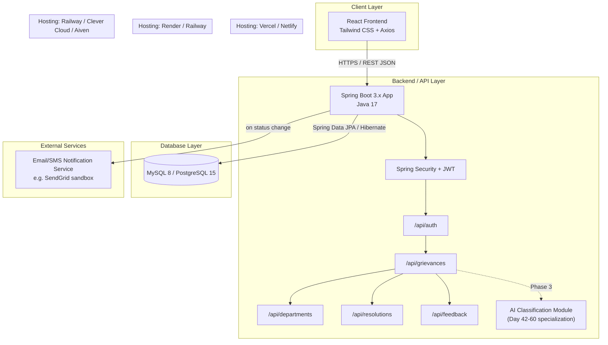

# System Architecture Diagram — v1

## Layer notes
- **Client**: React SPA, calls backend only via versioned REST endpoints, holds JWT in memory/localStorage.
- **Backend/API**: Spring Boot monolith (single deployable) — controller → service → repository layering, as per Section 6.5 of the master doc.
- **Database**: single relational DB, 5 core entities with FK relationships (see ER diagram).
- **External service**: notification dispatch on grievance status change — satisfies the "≥1 third-party integration" acceptance criterion.
- **Hosting boundary**: frontend and backend are deployed to *separate* platforms — this must be explicitly shown per Section 7.1.