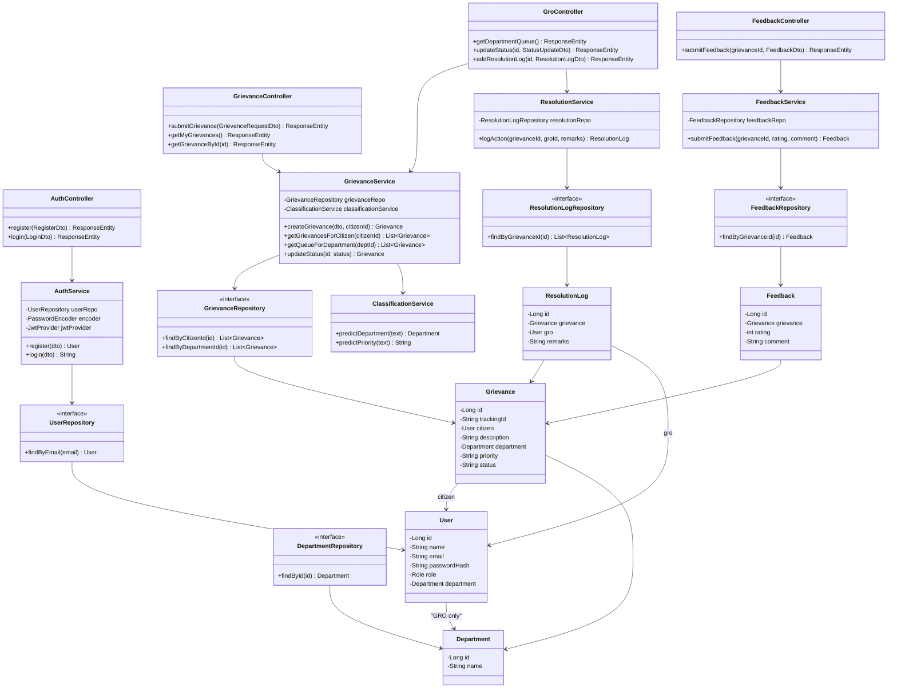

# Class / Module Diagram — v1

> Versioned at: Day 11 (this version). Updated at Day 41 and Day 60.
> Must match your actual code (Section 7.3) — keep this in sync as you build, don't let it drift.

