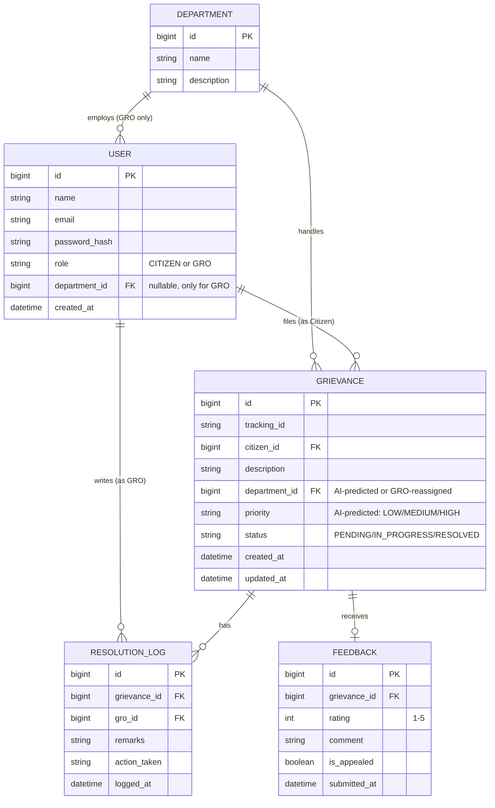

# Entity-Relationship (ER) Diagram — v1

> Versioned at: Day 11 (this version). Updated at Day 41 and Day 60.
> PK/FK shown per entity, per Section 7.2 of the master doc.



## Relationship summary
| Relationship | Type | Notes |
|---|---|---|
| Department → User (GRO) | One-to-Many | A department can have many GROs; a GRO belongs to exactly one department |
| Department → Grievance | One-to-Many | A department handles many grievances |
| User (Citizen) → Grievance | One-to-Many | A citizen can file many grievances |
| Grievance → ResolutionLog | One-to-Many | A grievance can accumulate multiple resolution actions over time |
| User (GRO) → ResolutionLog | One-to-Many | A GRO can log many resolution entries across grievances |
| Grievance → Feedback | One-to-One | Feedback is submitted once, after resolution |

## Alternative: DBML source (for dbdiagram.io, the doc's suggested tool)
Paste the block below into https://dbdiagram.io to get an auto-laid-out ER diagram + exportable PNG.

```dbml
Table department {
  id bigint [pk, increment]
  name varchar
  description varchar
}

Table user {
  id bigint [pk, increment]
  name varchar
  email varchar [unique]
  password_hash varchar
  role varchar // CITIZEN or GRO
  department_id bigint [ref: > department.id, note: 'nullable, GRO only']
  created_at datetime
}

Table grievance {
  id bigint [pk, increment]
  tracking_id varchar [unique]
  citizen_id bigint [ref: > user.id]
  description text
  department_id bigint [ref: > department.id]
  priority varchar // LOW / MEDIUM / HIGH
  status varchar // PENDING / IN_PROGRESS / RESOLVED
  created_at datetime
  updated_at datetime
}

Table resolution_log {
  id bigint [pk, increment]
  grievance_id bigint [ref: > grievance.id]
  gro_id bigint [ref: > user.id]
  remarks text
  action_taken varchar
  logged_at datetime
}

Table feedback {
  id bigint [pk, increment]
  grievance_id bigint [ref: - grievance.id]
  rating int
  comment text
  is_appealed boolean
  submitted_at datetime
}
```